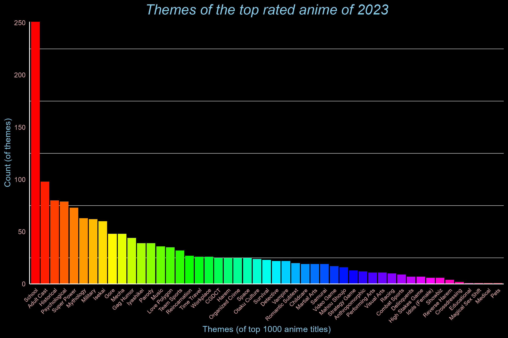
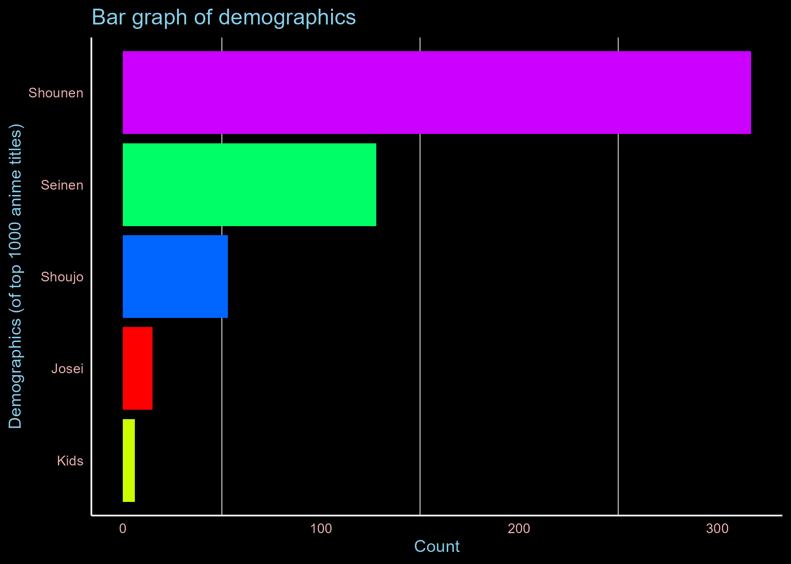

```{r setup, include=FALSE}
knitr::opts_chunk$set(echo = TRUE)
```

### **An Exploration of Anime Trends: Themes in the Top Shows of 2023**
#### **Rationale**:
Japanese animation, also known as **Anime**, has gained immense popularity over the years. As I grew up watching anime, the topic of which Genre or Theme was more interesting always sparked a debate between me and my friends. And thus, for my final project for PSY6422, I will try to visualise common recurring themes in the top 1000 highly rated anime of the year 2023 on My Anime List. 

Action, adventure, comedy, drama, romance, fantasy, sci-fi, and many more genres are covered in anime. Better recommendation systems can be created by having a better understanding of which genres perform better. The reason why I choose themes over genre is because one anime could have multiple themes thus making our criteria more inclusive and relatively comprehensive.

The data will be presented as a *bar graph*, which was selected as the visualisation method for my project because it plots the rankings of various categories well. I've made an interactive version of my plot using *Plotly* because the original had multiple columns, which made it difficult to follow. The interactive feature of the graph allows the reader to simply hover over a column to see its description, such as the theme name and count.

```{r echo=FALSE}
# Define the path to the image
image_path <- here::here("images/p1.png")

# Display the image
knitr::include_graphics(image_path)
```

*A still from [Tenki no ko](https://myanimelist.net/anime/38826/Tenki_no_Ko) by Makato Shinkai*

#### **Question I aim to visualise:**
+ The top animes had which themes?

### **Source of the Dataset :**

The dataset was acquired from Md Kazi Sajiduddin on [kaggle](https://www.kaggle.com/datasets/dbdmobile/myanimelist-dataset).
It was created around July 2023. Jikan Application Programming Interface (4.0.0) was used to extract the anime dataset via the My Anime list. The original dataset retrived  anime-related data, including the original title, the english title, Demographics, Start season, Airing date,Format, Studios, Synopsis, Production house, The User ID and the scores given by the users. [MyAnimeList](https://myanimelist.net/). 

### **What is My Anime List?**
Frequently shortened as MAL, MyAnimeList is a volunteer-run website that provides social networking and social cataloging services for fans of anime and manga. Users of the website can score and arrange anime and manga using a system similar to a list. It offers a comprehensive database on anime and manga and makes it easier to find users with similar interests.

### **What will my project include?**
The data included 24,985 anime titles that were rated by users on My Anime List. The original dataset had a plethora of information including The original title, english title, Demographics, Start season, Airing date,Format, Studios, Synopsis, Production house, The User ID and the scores given by the users. 
For my project, I will examine the top 1000 anime titles in the dataset to identify recurring *themes*. Additionally, I will also visualise if the *Demographics* of the anime, taking a look at the intended auidence for the title as it may help us understand the relevance of themes better. Thus, I make sure only these columns are retrieved from the rawdata. Also, it is to be noted that the scores are not included in the project as the list already consists of highly rated titles with very little deviation, so including the same would be redundant. The project will instead calculate the total count and same will be included for reference.

### **Folders in my project:**
The /Data consists of the raw data acquired from kaggle, /figures consist of the Plots generated in the project and /images consist of the image used in the project.

```{r message=FALSE, warning=FALSE, include=FALSE}

# Loading the libraries required 
if (!require("here")) install.packages("here") # used to create a relative path for the data
if (!require("readr")) install.packages("readr") # used to read data from csv file
if (!require("tidyverse")) install.packages("tidyverse") # used for visualising
if (!require("dplyr")) install.packages("dplyr") # used to clean data
if (!require("ggplot2")) install.packages("ggplot2") # used to clean data
if (!require("ggthemes")) install.packages("ggthemes") # Used to import additional themes
if (!require("kableExtra")) install.packages("kableExtra") # used for creating tables in the document 
if (!require("plotly")) install.packages("plotly")  #  used to create interactive plots
if (!require("tinytex")) install.packages("tinytex")  #  used to create pdf

library(here)
library(readr)
library(tidyverse)
library(dplyr)
library(ggthemes)
library(ggplot2)
library(kableExtra)
library(plotly)
library(tinytex)

```
### Importing the data
```{r echo=TRUE, message=FALSE, warning=FALSE}

# Selecting specific columns
cols <- c('themes', 'demographics')
# Specifying the file path of the dataset
file_path <- here::here("Data/anime.csv")
#n_max is set to 1000 in order to retrieve the top 1000 titles
data <- read_csv(file_path, col_select = cols,n_max = 1000) 

# Renaming the columns
data <- rename(data,
            Themes= themes,
            Demographics= demographics
            )
```


```{r echo=FALSE}
# Data Wrangling:
# Cleaning the data by removing the special characters from the dataset with the lapply function
# First, to remove the Brackets
data <- data.frame(lapply(data, function(x) gsub("^\\[|\\]$", "", x)))

# Second, to remove quotation marks
data <- data.frame(lapply(data, function(x) gsub("'", "", x)))
```


```{r echo=FALSE}
# Making a dataset called df that divides Themes converted into a longer format
# Separating them into a longer form after spliting them after a comma
df <- separate_rows(data, Themes, sep = ",\\s*")

# I further assigned it to theme_counts to get a count check of the themes in the df dataset
    theme_counts <- df %>%   
    count(Themes) %>%
# to filter out rows with empty values
    filter(Themes != "") %>% 
# Arranging n into descending order
    arrange(desc(n)) %>%  
# Renaming n as count
    rename(Count = n) 
```

### **A table of the total theme count from top rated 1000 anime titles on My Anime List**:
```{r echo=TRUE}
kable(theme_counts, format = "markdown")
```

### **An interactive plot of the Theme count**

```{r echo=TRUE, fig.height=6, fig.width=9, message=FALSE, warning=FALSE}
# Assigning the rainbow theme to each unique theme in theme_count
theme_colors <- rainbow(length(unique(theme_counts$Themes)))
#setting the hover text
hover_text <-paste('Theme:', theme_counts$Themes, '<br>Count:' , theme_counts$Count)  

# Creating the first graph as fig_1 with ggplot

fig1 <-
    ggplot(theme_counts, aes(x = reorder(Themes,-Count), y = Count, text = hover_text)) +
    geom_bar(stat = 'identity', fill = theme_colors) +
  
# To make the intervals on Y axis 50 and remove the gap between Y axis and 0    
    scale_y_continuous(breaks = seq(0, 250, by = 50),expand =c(0,0)) + 
# setting title
    ggtitle("Themes of the top rated anime of 2023") + 
# defining labels
    labs(x = "Themes (of top 1000 anime titles)", y = "Count (of themes)") + 

# customising theme 
    theme_minimal() +
    theme(
      
        plot.background = element_rect(fill = 'black'),  # To create a black background
        panel.background = element_rect(fill = 'black'), # To create a black panel background
        panel.grid.major = element_line(color = 'transparent'),  # To make major gridlines transparent
        axis.line = element_line(color = '#FFFFFF'),  # axis lines colour set as White
        axis.text = element_text(color = '#EEB4B4'),  # axis text colour set as rosybrown2
        axis.title = element_text(color = 'skyblue'), # axis title colour set as skyblue
        plot.title = element_text(color = 'skyblue', size = 18, hjust = 0.5, face = 'italic'),
        axis.text.x = element_text(angle = 45, hjust = 1, size = 7)  # x-axis text angle was adjusted to make it more readable
        ) +
  
 # Removing the legend as the name of the column and count can be seen in the hover text
        guides(fill = FALSE)  

#assigning the plot to plotly fr an interactive graph
fig1 <- ggplotly(fig1, tooltip= 'text')

# Saving the figure in the figures folder
ggsave(here::here('Figures', 'Themes_graph.png'))
```

#### Printing the graph
```{r echo=TRUE, fig.align='left', fig.height=6, fig.width=9, message=FALSE, warning=FALSE}

# A conditional statement is added here so an interactive graph is displayed when the document is a html page, or else as a png

# If html page, display the plotly graph
if (knitr::is_html_output()) {
  fig1
} else {
# Print the PNG image (for pdf)

}
```


#### Bonus Graph: **Demographics**
> We can better understand which themes and tropes appeal to particular audiences by using demographic data.Therefore we will take a look at demographics as well. Typical demographics consist of:

+ Shounen: Targeted towards young boys
+ Shoujo: Targeted towards young girls 
+ Seinen: Targeted towards adult men 
+ Josei: Targeted towards adult women 
+ Kids: Targeted towards Younger auidence

```{r echo=FALSE}
# Assigning the count of demographics to dem_count
# To separate a row that has comma in it

data <- separate_rows(data, Demographics, sep = ",\\s*")  
dem_counts <- data %>%
    count(Demographics) %>% 
#To filter out rows with empty values
    filter(Demographics != "") %>%
# Arranging the count in descending order
    arrange(desc(n)) %>% 
# Renaming n as count 
    rename(Count= n) 
```

```{r echo=TRUE}
kable(dem_counts, format = "markdown") 
```

### **A Graph that plots the demographics of the top 1000 anime of 2023**
```{r echo=TRUE, message=FALSE, warning=FALSE}
# Creating the second bar graph in ggplot
# Setting up rainbow themes for the graph by assigning a colour to each unique value
dem_colors <- rainbow(length(unique(dem_counts$Demographics))) 

#setting the hover text
hover_text <-paste('<br>Count:' , dem_counts$Count) 

#Creating the plot with ggplot
fig2 <- 
    ggplot(dem_counts, aes(x =reorder(Demographics,Count), y = Count, fill = Demographics,text= hover_text)) +
    geom_bar(stat= 'identity')+
  
  # defining labels
    labs(x= "Demographics (of top 1000 anime titles)", y= "Count", title= "Bar graph of demographics") + 
  
  # To create a horizontal chart 
    coord_flip() + 
    theme_minimal() +
  
  # Customising theme
  
  theme(
        plot.background = element_rect(fill = 'black'),  # To create black background
        panel.background = element_rect(fill = 'black'), # To create a black panel background
        panel.grid.major = element_line(color = 'transparent'),  # To make major gridlines transparent
        axis.line = element_line(color = '#FFFFFF'),  # axis lines colour set as White
        axis.text = element_text(color = '#EEB4B4'),  # axis text colour set as rosybrown2
        axis.title = element_text(color = 'skyblue'), # axis title colour set as skyblue
        plot.title = element_text(color = 'skyblue', size = 14),  # Plot title colour set to blue & size was adjusted
        
        ) +
  
    scale_fill_manual(values = dem_colors) +  # setting the colours in the plot
  
    # removing the legend because the plot is interactive and the names and count can be seen when clicked on
    guides(fill = FALSE) 

#assigning the plot to plotly for an interactive graph
fig2 <- ggplotly(fig2, tooltip = 'text')

# Saving the figure in the figures folder
ggsave(here::here('Figures', 'Demographics.png'))
```

#### Printing the graph : 
```{r echo=TRUE, fig.align='left'}
#A conditional statement is added here so an interactive graph is displayed when the document is a html page, or else as a png in pdf
if (knitr::is_html_output()) {
  fig2
} else {
  # Print the PNG image (for pdf)
  
}
```


#### **Insights:**

2023 saw a lot of successful anime releases in a variety of genres. However, a clear trend became apparent: audiences were drawn to stories set in schools. Other themes that did well were Adult Cast, Historical, Psychological, Super Power, Mythology, Military, and Isekai. 
One prominent genre of anime was shounen, which catered to young boys. The predominance of themes like school,action and adventure, which are typically popular with this demographic, may be explained by this focus on a male audience.


Seinen, an anime series targeted at adult men, is among the top demographics, though, indicating a more complex picture. Seinen anime often explores mature themes like psychology and complex character development (adult cast), which could explain why these themes were also highly rated in 2023. 

#### **Closing remarks:**

With this module, I was able to learn a new skill at my own pace. I can say that over time, my proficiency with R Studio and Github has improved somewhat. I also took advantage of this opportunity to research different themes and packages that could help me with my project. Exploring *plotly* was also one of the aspects of the project that I enjoyed, as creating interactive plots with informative tooltip assists in delivering information in a compact manner.
I also looked into using *renv* to manage project environments and make sure the necessary packages are installed correctly across various devices. 


If I had more time to work on the project, I would have loved to plot all of the variables based on various criteria (for example, contrasting highly rated versus low rated anime titles) to have a comprehensive understanding of criteria that make an anime series highly rated. One of the limiations of my project can be that the  plots were based on the top 1000 titles, for a more comprehensive analysis, data of all the titles can be visualised by future projects.

#### **References :**
+ Anime Dataset 2023. (2023, July 28). Kaggle. https://www.kaggle.com/datasets/dbdmobile/myanimelist-dataset 
+ Grolemund, G., & Wickham, H. (2014). R for Data science. https://edtechbooks.org/r_data_science 
+ MyAnimeList.net: *anime and manga database and community.* (n.d.). MyAnimeList.net. https://myanimelist.net/ 
+ R CODER. (n.d). *R colors [Full List, Color Converter and Color Picker]* | R CHARTS. 